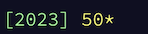
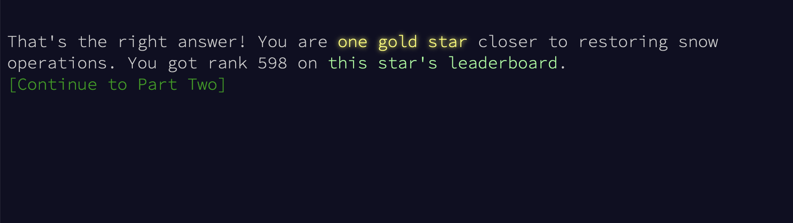

### Hi there 👋

<!--
**bostick/bostick** is a ✨ _special_ ✨ repository because its `README.md` (this file) appears on your GitHub profile.

Here are some ideas to get you started:

- 🔭 I’m currently working on ...
- 🌱 I’m currently learning ...
- 👯 I’m looking to collaborate on ...
- 🤔 I’m looking for help with ...
- 💬 Ask me about ...
- 📫 How to reach me: ...
- 😄 Pronouns: ...
- ⚡ Fun fact: ...
-->

- 📅 I am trying to complete [Advent of Code 2023](https://adventofcode.com/2023).

{: width="100" }

{: width="100" }

- ⏁ I am an engineer at [ZeroTier](https://www.zerotier.com).

- 🎵 I am working on [describing the TabIt .tbt file format](https://github.com/bostick/tabit-file-format) and
  [writing a parser for .tbt files](https://github.com/bostick/tbt-parser).

- 🔧 I created the [CodeTools suite of developer tools for Wolfram Language](https://bostick.github.io/wolfram-language/codetools/).

- 💬 I have given [talks](https://bostick.github.io/talks/).

- 📫 How to reach me: bostick@gmail.com
